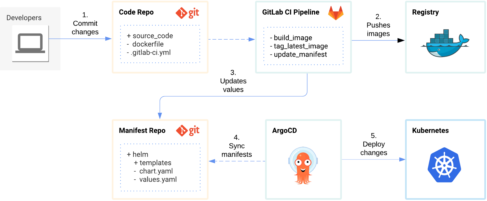

# GitOps
GitOps implementation with  GitlabCI, ArgoCD and HELM

Basic settings
------------
* GitLab CI Pipeline
* Kubernetes template using Helm Charts
* Continuous Deployment using ArgoCD
* GitOps repository structure
