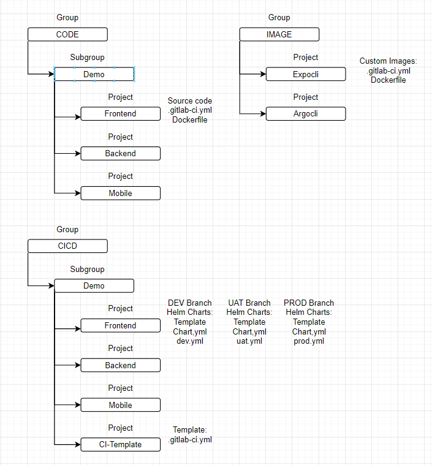

__GitOps__
================================

GitOps implementation with  GitlabCI, ArgoCD and HELM

Basic settings
------------
* GitLab CI Pipeline
* Kubernetes template using Helm Charts
* Continuous Deployment using ArgoCD
* GitOps repository structure

Gitlab repository structure
------------

__Requirements__
------------
* Gitlab
* ArgoCD
* Helm
* Expo

__Author Information__
------------------

Samir Nabadov
